report of MSA
================
曾品華
2018-06-15

介紹
====

這是由巴西最大的汽車和家庭保險公司Porto Seguro所提出的問題，目的是為了預測司機是否會需要保險索賠， 希望根據個人駕駛習慣提供更公平的保險費用。 更準確的預測將使他們能夠進一步量身定制價格，並有望使更多司機保車險

準備工作
========

讀取 library
------------

``` r
# general visualisation
library('ggplot2') # visualisation
library('scales') # visualisation
library('grid') # visualisation
library('ggthemes') # visualisation
library('gridExtra') # visualisation
library('RColorBrewer') # visualisation
library('corrplot') # visualisation
library('Rmisc') # visualisation

# general data manipulation
library('dplyr') # data manipulation
library('readr') # input/output
library('data.table') # data manipulation
library('tibble') # data wrangling
library('tidyr') # data wrangling
library('stringr') # string manipulation
library('forcats') # factor manipulation
library('rlang') # data manipulation

# specific visualisation
library('alluvial') # visualisation
#library('ggfortify') # visualisation
library('ggrepel') # visualisation
library('ggridges') # visualisation
library('VIM') # NAs
library('plotly') # interactive
library('ggforce') # visualisation

# modelling
library('Matrix')
library('xgboost') # modelling
library('caret') # modelling
library('MLmetrics') # gini metric
```

讀取資料
--------

``` r
train <- as.tibble(fread('train.csv', na.strings=c("-1","-1.0")))
test <- as.tibble(fread('test.csv', na.strings=c("-1","-1.0")))
```

資料內容
========

train data
----------

``` r
glimpse(train)
```

    ## Observations: 595,212
    ## Variables: 59
    ## $ id             <int> 7, 9, 13, 16, 17, 19, 20, 22, 26, 28, 34, 35, 3...
    ## $ target         <int> 0, 0, 0, 0, 0, 0, 0, 0, 0, 1, 0, 0, 0, 0, 0, 0,...
    ## $ ps_ind_01      <int> 2, 1, 5, 0, 0, 5, 2, 5, 5, 1, 5, 2, 2, 1, 5, 5,...
    ## $ ps_ind_02_cat  <int> 2, 1, 4, 1, 2, 1, 1, 1, 1, 1, 2, 1, 1, 1, 1, 1,...
    ## $ ps_ind_03      <int> 5, 7, 9, 2, 0, 4, 3, 4, 3, 2, 2, 3, 1, 3, 11, 3...
    ## $ ps_ind_04_cat  <int> 1, 0, 1, 0, 1, 0, 1, 0, 1, 0, 0, 1, 1, 1, 0, 1,...
    ## $ ps_ind_05_cat  <int> 0, 0, 0, 0, 0, 0, 0, 0, 0, 0, 0, 0, 0, 0, 0, 0,...
    ## $ ps_ind_06_bin  <int> 0, 0, 0, 1, 1, 0, 0, 1, 0, 0, 0, 0, 0, 0, 0, 0,...
    ## $ ps_ind_07_bin  <int> 1, 0, 0, 0, 0, 0, 1, 0, 0, 1, 0, 1, 0, 1, 0, 1,...
    ## $ ps_ind_08_bin  <int> 0, 1, 1, 0, 0, 0, 0, 0, 1, 0, 1, 0, 1, 0, 0, 0,...
    ## $ ps_ind_09_bin  <int> 0, 0, 0, 0, 0, 1, 0, 0, 0, 0, 0, 0, 0, 0, 1, 0,...
    ## $ ps_ind_10_bin  <int> 0, 0, 0, 0, 0, 0, 0, 0, 0, 0, 0, 0, 0, 0, 0, 0,...
    ## $ ps_ind_11_bin  <int> 0, 0, 0, 0, 0, 0, 0, 0, 0, 0, 0, 0, 0, 0, 0, 0,...
    ## $ ps_ind_12_bin  <int> 0, 0, 0, 0, 0, 0, 0, 0, 0, 0, 0, 0, 0, 0, 0, 0,...
    ## $ ps_ind_13_bin  <int> 0, 0, 0, 0, 0, 0, 0, 0, 0, 0, 0, 0, 0, 0, 0, 0,...
    ## $ ps_ind_14      <int> 0, 0, 0, 0, 0, 0, 0, 0, 0, 0, 0, 0, 0, 0, 0, 0,...
    ## $ ps_ind_15      <int> 11, 3, 12, 8, 9, 6, 8, 13, 6, 4, 3, 9, 10, 12, ...
    ## $ ps_ind_16_bin  <int> 0, 0, 1, 1, 1, 1, 1, 1, 1, 0, 1, 1, 1, 1, 0, 0,...
    ## $ ps_ind_17_bin  <int> 1, 0, 0, 0, 0, 0, 0, 0, 0, 0, 0, 0, 0, 0, 0, 0,...
    ## $ ps_ind_18_bin  <int> 0, 1, 0, 0, 0, 0, 0, 0, 0, 1, 0, 0, 0, 0, 1, 1,...
    ## $ ps_reg_01      <dbl> 0.7, 0.8, 0.0, 0.9, 0.7, 0.9, 0.6, 0.7, 0.9, 0....
    ## $ ps_reg_02      <dbl> 0.2, 0.4, 0.0, 0.2, 0.6, 1.8, 0.1, 0.4, 0.7, 1....
    ## $ ps_reg_03      <dbl> 0.7180703, 0.7660777, NA, 0.5809475, 0.8407586,...
    ## $ ps_car_01_cat  <int> 10, 11, 7, 7, 11, 10, 6, 11, 10, 11, 11, 11, 6,...
    ## $ ps_car_02_cat  <int> 1, 1, 1, 1, 1, 0, 1, 1, 1, 0, 1, 0, 1, 1, 1, 1,...
    ## $ ps_car_03_cat  <int> NA, NA, NA, 0, NA, NA, NA, 0, NA, 0, NA, NA, NA...
    ## $ ps_car_04_cat  <int> 0, 0, 0, 0, 0, 0, 0, 0, 0, 1, 8, 0, 0, 0, 0, 9,...
    ## $ ps_car_05_cat  <int> 1, NA, NA, 1, NA, 0, 1, 0, 1, 0, NA, NA, NA, 1,...
    ## $ ps_car_06_cat  <int> 4, 11, 14, 11, 14, 14, 11, 11, 14, 14, 13, 11, ...
    ## $ ps_car_07_cat  <int> 1, 1, 1, 1, 1, 1, 1, 1, 1, 1, 1, 1, 1, 1, 1, 1,...
    ## $ ps_car_08_cat  <int> 0, 1, 1, 1, 1, 1, 1, 1, 1, 1, 1, 0, 1, 1, 1, 0,...
    ## $ ps_car_09_cat  <int> 0, 2, 2, 3, 2, 0, 0, 2, 0, 2, 2, 0, 2, 2, 2, 0,...
    ## $ ps_car_10_cat  <int> 1, 1, 1, 1, 1, 1, 1, 1, 1, 1, 1, 1, 1, 1, 1, 1,...
    ## $ ps_car_11_cat  <int> 12, 19, 60, 104, 82, 104, 99, 30, 68, 104, 20, ...
    ## $ ps_car_11      <int> 2, 3, 1, 1, 3, 2, 2, 3, 3, 2, 3, 3, 3, 3, 1, 2,...
    ## $ ps_car_12      <dbl> 0.4000000, 0.3162278, 0.3162278, 0.3741657, 0.3...
    ## $ ps_car_13      <dbl> 0.8836789, 0.6188165, 0.6415857, 0.5429488, 0.5...
    ## $ ps_car_14      <dbl> 0.3708099, 0.3887158, 0.3472751, 0.2949576, 0.3...
    ## $ ps_car_15      <dbl> 3.605551, 2.449490, 3.316625, 2.000000, 2.00000...
    ## $ ps_calc_01     <dbl> 0.6, 0.3, 0.5, 0.6, 0.4, 0.7, 0.2, 0.1, 0.9, 0....
    ## $ ps_calc_02     <dbl> 0.5, 0.1, 0.7, 0.9, 0.6, 0.8, 0.6, 0.5, 0.8, 0....
    ## $ ps_calc_03     <dbl> 0.2, 0.3, 0.1, 0.1, 0.0, 0.4, 0.5, 0.1, 0.6, 0....
    ## $ ps_calc_04     <int> 3, 2, 2, 2, 2, 3, 2, 1, 3, 2, 2, 2, 4, 2, 3, 2,...
    ## $ ps_calc_05     <int> 1, 1, 2, 4, 2, 1, 2, 2, 1, 2, 3, 2, 1, 1, 1, 1,...
    ## $ ps_calc_06     <int> 10, 9, 9, 7, 6, 8, 8, 7, 7, 8, 8, 8, 8, 10, 8, ...
    ## $ ps_calc_07     <int> 1, 5, 1, 1, 3, 2, 1, 1, 3, 2, 2, 2, 4, 1, 2, 5,...
    ## $ ps_calc_08     <int> 10, 8, 8, 8, 10, 11, 8, 6, 9, 9, 9, 10, 11, 8, ...
    ## $ ps_calc_09     <int> 1, 1, 2, 4, 2, 3, 3, 1, 4, 1, 4, 1, 1, 3, 3, 2,...
    ## $ ps_calc_10     <int> 5, 7, 7, 2, 12, 8, 10, 13, 11, 11, 7, 8, 9, 8, ...
    ## $ ps_calc_11     <int> 9, 3, 4, 2, 3, 4, 3, 7, 4, 3, 6, 9, 6, 2, 4, 5,...
    ## $ ps_calc_12     <int> 1, 1, 2, 2, 1, 2, 0, 1, 2, 5, 3, 2, 3, 0, 1, 2,...
    ## $ ps_calc_13     <int> 5, 1, 7, 4, 1, 0, 0, 3, 1, 0, 3, 1, 3, 4, 3, 6,...
    ## $ ps_calc_14     <int> 8, 9, 7, 9, 3, 9, 10, 6, 5, 6, 6, 10, 8, 3, 9, ...
    ## $ ps_calc_15_bin <int> 0, 0, 0, 0, 0, 0, 0, 1, 0, 0, 0, 0, 0, 0, 0, 0,...
    ## $ ps_calc_16_bin <int> 1, 1, 1, 0, 0, 1, 1, 0, 1, 1, 1, 1, 0, 0, 0, 1,...
    ## $ ps_calc_17_bin <int> 1, 1, 1, 0, 0, 0, 0, 1, 0, 0, 1, 0, 1, 1, 0, 1,...
    ## $ ps_calc_18_bin <int> 0, 0, 0, 0, 1, 1, 0, 0, 0, 0, 0, 1, 0, 0, 0, 0,...
    ## $ ps_calc_19_bin <int> 0, 1, 1, 0, 1, 1, 1, 1, 0, 1, 1, 0, 0, 1, 1, 1,...
    ## $ ps_calc_20_bin <int> 1, 0, 0, 0, 0, 1, 0, 0, 1, 0, 1, 0, 1, 0, 0, 0,...

test data
---------

``` r
glimpse(test)
```

    ## Observations: 892,816
    ## Variables: 58
    ## $ id             <int> 0, 1, 2, 3, 4, 5, 6, 8, 10, 11, 12, 14, 15, 18,...
    ## $ ps_ind_01      <int> 0, 4, 5, 0, 5, 0, 0, 0, 0, 1, 0, 1, 1, 3, 0, 2,...
    ## $ ps_ind_02_cat  <int> 1, 2, 1, 1, 1, 1, 1, 1, 1, 1, 1, 1, 1, 1, 2, 2,...
    ## $ ps_ind_03      <int> 8, 5, 3, 6, 7, 6, 3, 0, 7, 6, 5, 4, 2, 3, 1, 2,...
    ## $ ps_ind_04_cat  <int> 1, 1, 0, 0, 0, 0, 0, 0, 0, 0, 0, 0, 1, 0, 0, 0,...
    ## $ ps_ind_05_cat  <int> 0, 0, 0, 0, 0, 0, 0, 0, 0, 0, 4, 0, 0, 0, 6, 0,...
    ## $ ps_ind_06_bin  <int> 0, 0, 0, 1, 0, 1, 0, 1, 0, 0, 1, 1, 0, 0, 1, 0,...
    ## $ ps_ind_07_bin  <int> 1, 0, 0, 0, 0, 0, 1, 0, 1, 0, 0, 0, 1, 1, 0, 0,...
    ## $ ps_ind_08_bin  <int> 0, 0, 0, 0, 0, 0, 0, 0, 0, 0, 0, 0, 0, 0, 0, 1,...
    ## $ ps_ind_09_bin  <int> 0, 1, 1, 0, 1, 0, 0, 0, 0, 1, 0, 0, 0, 0, 0, 0,...
    ## $ ps_ind_10_bin  <int> 0, 0, 0, 0, 0, 0, 0, 0, 0, 0, 0, 0, 0, 0, 0, 0,...
    ## $ ps_ind_11_bin  <int> 0, 0, 0, 0, 0, 0, 0, 0, 0, 0, 0, 0, 0, 0, 0, 0,...
    ## $ ps_ind_12_bin  <int> 0, 0, 0, 0, 0, 0, 0, 0, 0, 0, 0, 0, 0, 0, 0, 0,...
    ## $ ps_ind_13_bin  <int> 0, 0, 0, 0, 0, 0, 0, 0, 0, 0, 0, 0, 0, 0, 0, 0,...
    ## $ ps_ind_14      <int> 0, 0, 0, 0, 0, 0, 0, 0, 0, 0, 0, 0, 0, 0, 0, 0,...
    ## $ ps_ind_15      <int> 12, 5, 10, 4, 4, 10, 11, 7, 6, 7, 3, 9, 8, 0, 8...
    ## $ ps_ind_16_bin  <int> 1, 1, 0, 1, 1, 1, 0, 1, 1, 0, 1, 1, 1, 1, 0, 1,...
    ## $ ps_ind_17_bin  <int> 0, 0, 0, 0, 0, 0, 1, 0, 0, 1, 0, 0, 0, 0, 0, 0,...
    ## $ ps_ind_18_bin  <int> 0, 0, 0, 0, 0, 0, 0, 0, 0, 0, 0, 0, 0, 0, 0, 0,...
    ## $ ps_reg_01      <dbl> 0.5, 0.9, 0.4, 0.1, 0.9, 0.9, 0.1, 0.9, 0.4, 0....
    ## $ ps_reg_02      <dbl> 0.3, 0.5, 0.0, 0.2, 0.4, 0.5, 0.1, 1.1, 0.0, 1....
    ## $ ps_reg_03      <dbl> 0.6103278, 0.7713624, 0.9161741, NA, 0.8177714,...
    ## $ ps_car_01_cat  <int> 7, 4, 11, 7, 11, 9, 6, 7, 11, 11, 11, 11, 11, 1...
    ## $ ps_car_02_cat  <int> 1, 1, 1, 1, 1, 1, 1, 1, 0, 0, 1, 1, 0, 1, 0, 1,...
    ## $ ps_car_03_cat  <int> NA, NA, NA, NA, NA, NA, NA, NA, 1, NA, NA, NA, ...
    ## $ ps_car_04_cat  <int> 0, 0, 0, 0, 0, 0, 0, 0, 1, 0, 0, 0, 0, 1, 0, 2,...
    ## $ ps_car_05_cat  <int> NA, 0, NA, NA, NA, NA, 0, NA, 0, NA, NA, NA, 1,...
    ## $ ps_car_06_cat  <int> 1, 11, 14, 1, 11, 11, 1, 11, 2, 4, 11, 7, 6, 1,...
    ## $ ps_car_07_cat  <int> 1, 1, 1, 1, 1, 0, 1, 1, NA, 1, 1, 1, 1, 1, 1, 1...
    ## $ ps_car_08_cat  <int> 1, 1, 1, 1, 1, 0, 1, 1, 0, 1, 0, 0, 1, 0, 1, 1,...
    ## $ ps_car_09_cat  <int> 2, 0, 2, 2, 2, 2, 0, 2, 0, 2, 0, 2, 2, 1, 0, 2,...
    ## $ ps_car_10_cat  <int> 1, 1, 1, 1, 1, 1, 1, 1, 1, 1, 1, 1, 1, 1, 1, 1,...
    ## $ ps_car_11_cat  <int> 65, 103, 29, 40, 101, 11, 10, 103, 104, 104, 10...
    ## $ ps_car_11      <int> 1, 1, 3, 2, 3, 2, 2, 3, 2, 2, 3, 3, 2, 1, 2, 0,...
    ## $ ps_car_12      <dbl> 0.3162278, 0.3162278, 0.4000000, 0.3741657, 0.3...
    ## $ ps_car_13      <dbl> 0.6695564, 0.6063200, 0.8962387, 0.6521104, 0.8...
    ## $ ps_car_14      <dbl> 0.3521363, 0.3583295, 0.3984972, 0.3814446, 0.3...
    ## $ ps_car_15      <dbl> 3.464102, 2.828427, 3.316625, 2.449490, 3.31662...
    ## $ ps_calc_01     <dbl> 0.1, 0.4, 0.6, 0.1, 0.9, 0.7, 0.9, 0.8, 0.9, 0....
    ## $ ps_calc_02     <dbl> 0.8, 0.5, 0.6, 0.5, 0.6, 0.9, 0.8, 0.9, 0.3, 0....
    ## $ ps_calc_03     <dbl> 0.6, 0.4, 0.6, 0.5, 0.8, 0.4, 0.8, 0.5, 0.0, 0....
    ## $ ps_calc_04     <int> 1, 3, 2, 2, 3, 2, 1, 2, 2, 2, 2, 2, 3, 2, 2, 1,...
    ## $ ps_calc_05     <int> 1, 3, 3, 1, 4, 1, 1, 2, 2, 1, 2, 2, 1, 2, 3, 4,...
    ## $ ps_calc_06     <int> 6, 8, 7, 7, 7, 9, 7, 8, 9, 7, 5, 9, 8, 7, 7, 8,...
    ## $ ps_calc_07     <int> 3, 4, 4, 3, 1, 5, 3, 4, 7, 1, 5, 3, 0, 1, 3, 3,...
    ## $ ps_calc_08     <int> 6, 10, 6, 12, 10, 9, 9, 11, 9, 9, 7, 10, 9, 9, ...
    ## $ ps_calc_09     <int> 2, 2, 3, 1, 4, 4, 5, 2, 0, 1, 2, 1, 4, 1, 4, 3,...
    ## $ ps_calc_10     <int> 9, 7, 12, 13, 12, 12, 6, 8, 10, 11, 10, 4, 7, 1...
    ## $ ps_calc_11     <int> 1, 2, 4, 5, 4, 8, 2, 3, 5, 6, 2, 4, 3, 7, 6, 9,...
    ## $ ps_calc_12     <int> 1, 0, 0, 1, 0, 1, 0, 1, 1, 1, 1, 2, 4, 0, 3, 0,...
    ## $ ps_calc_13     <int> 1, 3, 2, 0, 0, 4, 4, 4, 4, 6, 1, 7, 0, 5, 5, 2,...
    ## $ ps_calc_14     <int> 12, 10, 4, 5, 4, 9, 6, 9, 6, 10, 8, 8, 12, 9, 6...
    ## $ ps_calc_15_bin <int> 0, 0, 0, 1, 0, 1, 1, 0, 0, 0, 0, 0, 1, 0, 0, 0,...
    ## $ ps_calc_16_bin <int> 1, 0, 0, 0, 1, 0, 1, 1, 0, 1, 1, 1, 1, 0, 0, 0,...
    ## $ ps_calc_17_bin <int> 1, 1, 0, 1, 1, 1, 0, 0, 1, 1, 1, 0, 0, 0, 1, 1,...
    ## $ ps_calc_18_bin <int> 0, 1, 0, 0, 0, 0, 0, 0, 0, 0, 1, 1, 0, 1, 0, 1,...
    ## $ ps_calc_19_bin <int> 0, 0, 0, 0, 0, 1, 0, 0, 0, 0, 0, 0, 1, 0, 0, 0,...
    ## $ ps_calc_20_bin <int> 1, 1, 0, 0, 1, 0, 0, 0, 0, 0, 0, 0, 0, 0, 0, 0,...

NA值
----

``` r
sum(is.na(train))
```

    ## [1] 846458

``` r
sum(is.na(test))
```

    ## [1] 1270295

數據類型轉換
------------

``` r
train <- train %>%
  mutate_at(vars(ends_with("cat")), funs(factor)) %>%
  mutate_at(vars(ends_with("bin")), funs(as.logical)) %>%
  mutate(target = as.factor(target))
test <- test %>%
  mutate_at(vars(ends_with("cat")), funs(factor)) %>%
  mutate_at(vars(ends_with("bin")), funs(as.logical))
```

資料的分布圖
============

Binary features part 1
----------------------

``` r
p1 <- train %>%
  ggplot(aes(ps_ind_06_bin, fill = ps_ind_06_bin)) +
  geom_bar() +
  theme(legend.position = "none")


p2 <- train %>%
  ggplot(aes(ps_ind_07_bin, fill = ps_ind_07_bin)) +
  geom_bar() +
  theme(legend.position = "none")

p3 <- train %>%
  ggplot(aes(ps_ind_08_bin, fill = ps_ind_08_bin)) +
  geom_bar() +
  theme(legend.position = "none")

p4 <- train %>%
  ggplot(aes(ps_ind_09_bin, fill = ps_ind_09_bin)) +
  geom_bar() +
  theme(legend.position = "none")

p5 <- train %>%
  ggplot(aes(ps_ind_10_bin, fill = ps_ind_10_bin)) +
  geom_bar() +
  theme(legend.position = "none")

p6 <- train %>%
  ggplot(aes(ps_ind_11_bin, fill = ps_ind_11_bin)) +
  geom_bar() +
  theme(legend.position = "none")

p7 <- train %>%
  ggplot(aes(ps_ind_12_bin, fill = ps_ind_12_bin)) +
  geom_bar() +
  theme(legend.position = "none")

p8 <- train %>%
  ggplot(aes(ps_ind_13_bin, fill = ps_ind_13_bin)) +
  geom_bar() +
  theme(legend.position = "none")

layout <- matrix(c(1,2,3,4,5,6,7,8),2,4,byrow=TRUE)
multiplot(p1, p2, p3, p4, p5, p6, p7, p8, layout=layout)
```

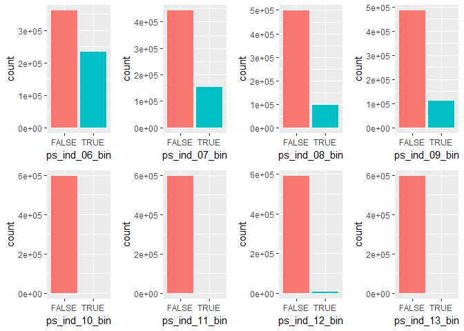
<p class="caption">
Fig. 1
</p>

Binary features part 2
----------------------

``` r
p1 <- train %>%
  ggplot(aes(ps_ind_16_bin, fill = ps_ind_16_bin)) +
  geom_bar() +
  theme(legend.position = "none")

p2 <- train %>%
  ggplot(aes(ps_ind_17_bin, fill = ps_ind_17_bin)) +
  geom_bar() +
  theme(legend.position = "none")

p3 <- train %>%
  ggplot(aes(ps_ind_18_bin, fill = ps_ind_18_bin)) +
  geom_bar() +
  theme(legend.position = "none")

p4 <- train %>%
  ggplot(aes(ps_calc_15_bin, fill = ps_calc_15_bin)) +
  geom_bar() +
  theme(legend.position = "none")

p5 <- train %>%
  ggplot(aes(ps_calc_16_bin, fill = ps_calc_16_bin)) +
  geom_bar() +
  theme(legend.position = "none")

p6 <- train %>%
  ggplot(aes(ps_calc_17_bin, fill = ps_calc_17_bin)) +
  geom_bar() +
  theme(legend.position = "none")

p7 <- train %>%
  ggplot(aes(ps_calc_18_bin, fill = ps_calc_18_bin)) +
  geom_bar() +
  theme(legend.position = "none")

p8 <- train %>%
  ggplot(aes(ps_calc_19_bin, fill = ps_calc_19_bin)) +
  geom_bar() +
  theme(legend.position = "none")

p9 <- train %>%
  ggplot(aes(ps_calc_20_bin, fill = ps_calc_20_bin)) +
  geom_bar() +
  theme(legend.position = "none")

layout <- matrix(c(1,2,3,4,5,6,7,8,9,9),2,5,byrow=TRUE)
multiplot(p1, p2, p3, p4, p5, p6, p7, p8, p9, layout=layout)
```

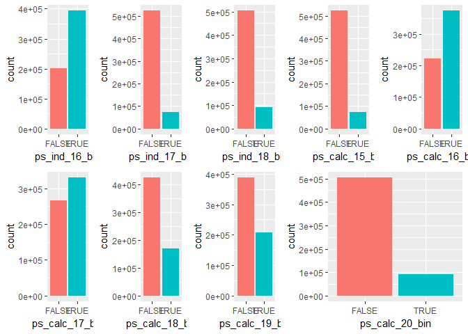
<p class="caption">
Fig. 2
</p>

Categorical features part 1
---------------------------

``` r
p1 <- train %>%
  ggplot(aes(ps_ind_02_cat, fill = ps_ind_02_cat)) +
  geom_bar() +
  scale_y_log10() +
  theme(legend.position = "none")

p2 <- train %>%
  ggplot(aes(ps_ind_04_cat, fill = ps_ind_04_cat)) +
  geom_bar() +
  scale_y_log10() +
  theme(legend.position = "none")

p3 <- train %>%
  ggplot(aes(ps_ind_05_cat, fill = ps_ind_05_cat)) +
  geom_bar() +
  scale_y_log10() +
  theme(legend.position = "none")

p4 <- train %>%
  ggplot(aes(ps_car_01_cat, fill = ps_car_01_cat)) +
  geom_bar() +
  scale_y_log10() +
  theme(legend.position = "none")

p5 <- train %>%
  ggplot(aes(ps_car_02_cat, fill = ps_car_02_cat)) +
  geom_bar() +
  scale_y_log10() +
  theme(legend.position = "none")

p6 <- train %>%
  ggplot(aes(ps_car_03_cat, fill = ps_car_03_cat)) +
  geom_bar() +
  scale_y_log10() +
  theme(legend.position = "none")

layout <- matrix(c(1,2,3,4,5,6),3,2,byrow=TRUE)
multiplot(p1, p2, p3, p4, p5, p6, layout=layout)
```

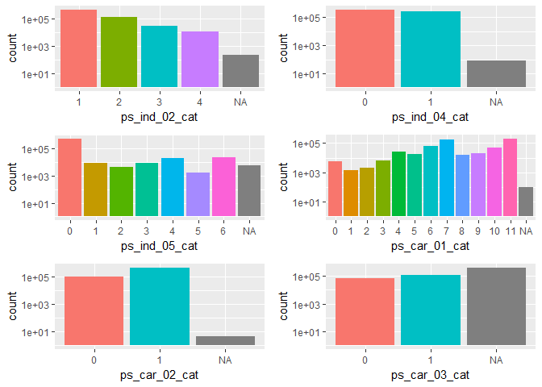
<p class="caption">
Fig. 3
</p>

Categorical features part 2
---------------------------

``` r
p1 <- train %>%
  ggplot(aes(ps_car_04_cat, fill = ps_car_04_cat)) +
  geom_bar() +
  scale_y_log10() +
  theme(legend.position = "none")

p2 <- train %>%
  ggplot(aes(ps_car_05_cat, fill = ps_car_05_cat)) +
  geom_bar() +
  scale_y_log10() +
  theme(legend.position = "none")

p3 <- train %>%
  ggplot(aes(ps_car_06_cat, fill = ps_car_06_cat)) +
  geom_bar() +
  scale_y_log10() +
  theme(legend.position = "none")

p4 <- train %>%
  ggplot(aes(ps_car_07_cat, fill = ps_car_07_cat)) +
  geom_bar() +
  scale_y_log10() +
  theme(legend.position = "none")

p5 <- train %>%
  ggplot(aes(ps_car_08_cat, fill = ps_car_08_cat)) +
  geom_bar() +
  scale_y_log10() +
  theme(legend.position = "none")

p6 <- train %>%
  ggplot(aes(ps_car_09_cat, fill = ps_car_09_cat)) +
  geom_bar() +
  scale_y_log10() +
  theme(legend.position = "none")

p7 <- train %>%
  ggplot(aes(ps_car_10_cat, fill = ps_car_10_cat)) +
  geom_bar() +
  scale_y_log10() +
  theme(legend.position = "none")

p8 <- train %>%
  ggplot(aes(ps_car_11_cat, fill = ps_car_11_cat)) +
  geom_bar() +
  scale_y_log10() +
  theme(legend.position = "none")

layout <- matrix(c(1,1,2,3,4,4,5,5,6,6,7,7,8,8,8,8),4,4,byrow=TRUE)
multiplot(p1, p2, p4, p3, p5, p6, p7, p8, layout=layout)
```


<p class="caption">
Fig. 4
</p>

Integer features part 1: "ind" and "car"
----------------------------------------

``` r
p1 <- train %>%
  mutate(ps_ind_01 = as.factor(ps_ind_01)) %>%
  ggplot(aes(ps_ind_01, fill = ps_ind_01)) +
  geom_bar() +
  theme(legend.position = "none")

p2 <- train %>%
  mutate(ps_ind_03 = as.factor(ps_ind_03)) %>%
  ggplot(aes(ps_ind_03, fill = ps_ind_03)) +
  geom_bar() +
  theme(legend.position = "none")

p3 <- train %>%
  mutate(ps_ind_14 = as.factor(ps_ind_14)) %>%
  ggplot(aes(ps_ind_14, fill = ps_ind_14)) +
  geom_bar() +
  scale_y_log10() +
  theme(legend.position = "none")

p4 <- train %>%
  mutate(ps_ind_15 = as.factor(ps_ind_15)) %>%
  ggplot(aes(ps_ind_15, fill = ps_ind_15)) +
  geom_bar() +
  theme(legend.position = "none")

p5 <- train %>%
  mutate(ps_car_11 = as.factor(ps_car_11)) %>%
  ggplot(aes(ps_car_11, fill = ps_car_11)) +
  geom_bar() +
  theme(legend.position = "none")


layout <- matrix(c(1,1,2,2,3,4,4,5),2,4,byrow=TRUE)
multiplot(p1, p2, p3, p4, p5, layout=layout)
```

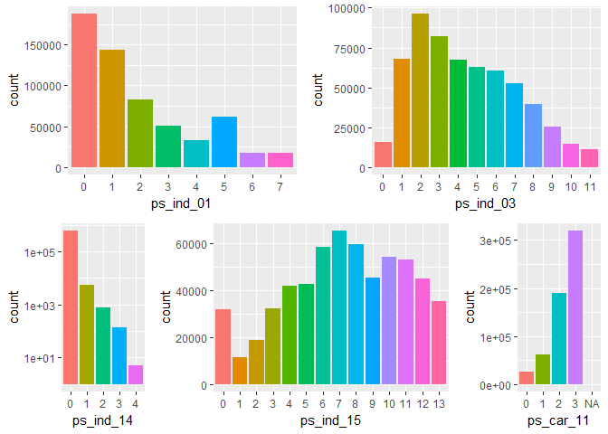
<p class="caption">
Fig. 5
</p>

Integer features part 2: "calc"
-------------------------------

``` r
p1 <- train %>%
  mutate(ps_calc_04 = as.factor(ps_calc_04)) %>%
  ggplot(aes(ps_calc_04, fill = ps_calc_04)) +
  geom_bar() +
  theme(legend.position = "none")

p2 <- train %>%
  mutate(ps_calc_05 = as.factor(ps_calc_05)) %>%
  ggplot(aes(ps_calc_05, fill = ps_calc_05)) +
  geom_bar() +
  theme(legend.position = "none")

p3 <- train %>%
  mutate(ps_calc_06 = as.factor(ps_calc_06)) %>%
  ggplot(aes(ps_calc_06, fill = ps_calc_06)) +
  geom_bar() +
  theme(legend.position = "none")

p4 <- train %>%
  mutate(ps_calc_07 = as.factor(ps_calc_07)) %>%
  ggplot(aes(ps_calc_07, fill = ps_calc_07)) +
  geom_bar() +
  theme(legend.position = "none")

p5 <- train %>%
  mutate(ps_calc_08 = as.factor(ps_calc_08)) %>%
  ggplot(aes(ps_calc_08, fill = ps_calc_08)) +
  geom_bar() +
  theme(legend.position = "none")

p6 <- train %>%
  mutate(ps_calc_09 = as.factor(ps_calc_09)) %>%
  ggplot(aes(ps_calc_09, fill = ps_calc_09)) +
  geom_bar() +
  theme(legend.position = "none")

p7 <- train %>%
  ggplot(aes(ps_calc_10, fill = ps_calc_10)) +
  geom_histogram(fill = "blue", binwidth = 1) +
  theme(legend.position = "none")

p8 <- train %>%
  ggplot(aes(ps_calc_11, fill = ps_calc_11)) +
  geom_histogram(fill = "blue", binwidth = 1) +
  theme(legend.position = "none")

p9 <- train %>%
  mutate(ps_calc_12 = as.factor(ps_calc_12)) %>%
  ggplot(aes(ps_calc_12, fill = ps_calc_12)) +
  geom_bar() +
  theme(legend.position = "none")

p10 <- train %>%
  mutate(ps_calc_13 = as.factor(ps_calc_13)) %>%
  ggplot(aes(ps_calc_13, fill = ps_calc_13)) +
  geom_bar() +
  theme(legend.position = "none")

p11 <- train %>%
  ggplot(aes(ps_calc_14, fill = ps_calc_14)) +
  geom_histogram(fill = "blue", binwidth = 1) +
  theme(legend.position = "none")

layout <- matrix(c(1,2,3,4,5,6,7,8,9,10,11,11),3,4,byrow=TRUE)
multiplot(p1, p2, p3, p4, p5, p6, p7, p8, p9, p10, p11, layout=layout)
```

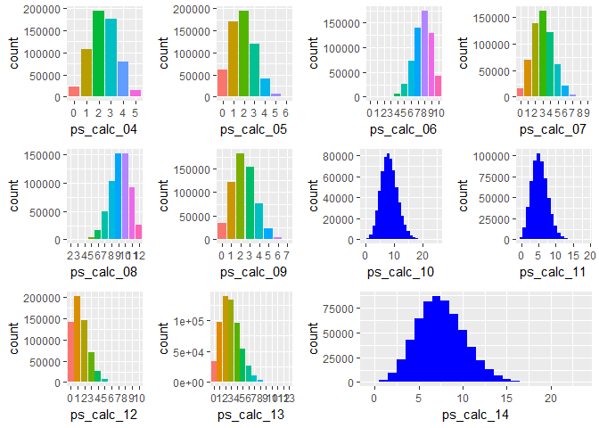
<p class="caption">
Fig. 6
</p>

Float features part 1: "reg" and "calc"
---------------------------------------

``` r
p1 <- train %>%
  ggplot(aes(ps_reg_01, fill = ps_reg_01)) +
  geom_histogram(fill = "dark green", binwidth = 0.1) +
  theme(legend.position = "none")

p2 <- train %>%
  ggplot(aes(ps_reg_02, fill = ps_reg_02)) +
  geom_histogram(fill = "dark green", binwidth = 0.1) +
  theme(legend.position = "none")

p3 <- train %>%
  ggplot(aes(ps_reg_03, fill = ps_reg_03)) +
  geom_histogram(fill = "dark green", binwidth = 0.1) +
  theme(legend.position = "none")

p4 <- train %>%
  ggplot(aes(ps_calc_01, fill = ps_calc_01)) +
  geom_histogram(fill = "blue", binwidth = 0.1) +
  theme(legend.position = "none")

p5 <- train %>%
  ggplot(aes(ps_calc_02, fill = ps_calc_02)) +
  geom_histogram(fill = "blue", binwidth = 0.1) +
  theme(legend.position = "none")

p6 <- train %>%
  ggplot(aes(ps_calc_03, fill = ps_calc_03)) +
  geom_histogram(fill = "blue", binwidth = 0.1) +
  theme(legend.position = "none")


layout <- matrix(c(1,2,3,4,5,6),2,3,byrow=TRUE)
multiplot(p1, p2, p3, p4, p5, p6, layout=layout)
```

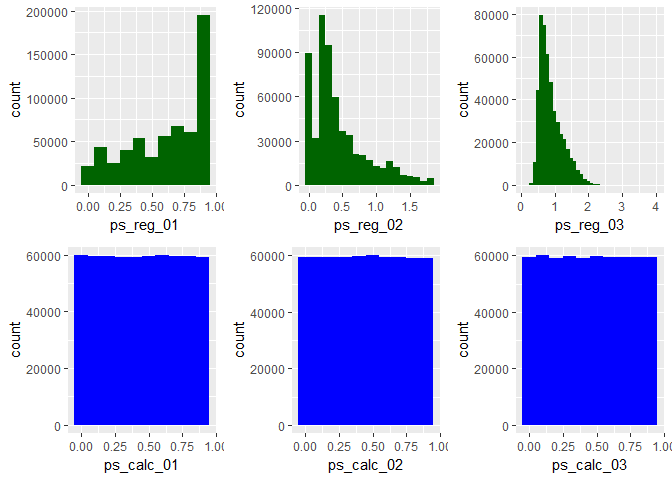
<p class="caption">
Fig. 7
</p>

Float features part 2: "car"
----------------------------

``` r
p1 <- train %>%
  ggplot(aes(ps_car_12, fill = ps_car_12)) +
  geom_histogram(binwidth = 0.05) +
  theme(legend.position = "none")

p2 <- train %>%
  ggplot(aes(ps_car_13, fill = ps_car_13)) +
  geom_histogram(binwidth = 0.1) +
  theme(legend.position = "none")

p3 <- train %>%
  ggplot(aes(ps_car_14, fill = ps_car_14)) +
  geom_histogram(binwidth = 0.01) +
  theme(legend.position = "none")

p4 <- train %>%
  ggplot(aes(ps_car_15, fill = ps_car_15)) +
  geom_histogram(binwidth = 0.1) +
  theme(legend.position = "none")

layout <- matrix(c(1,2,3,4),2,2,byrow=TRUE)
multiplot(p1, p2, p3, p4, layout=layout)
```

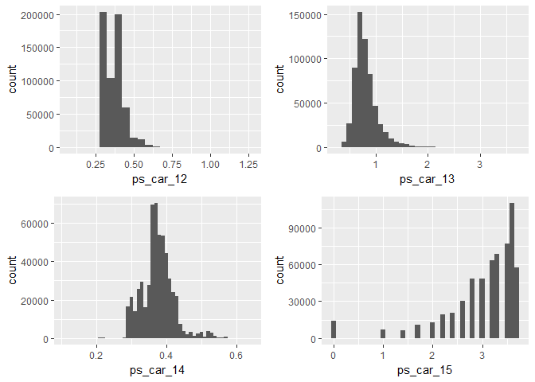
<p class="caption">
Fig. 8
</p>

Target variable
---------------

``` r
train %>%
  ggplot(aes(target, fill = target)) +
  geom_bar() +
  theme(legend.position = "none")
```

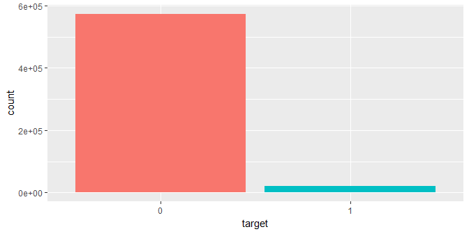
<p class="caption">
Fig. 9
</p>

We find:

``` r
train %>%
  group_by(target) %>%
  summarise(percentage = n()/nrow(train)*100)
```

    ## # A tibble: 2 x 2
    ##   target percentage
    ##   <fct>       <dbl>
    ## 1 0           96.4 
    ## 2 1            3.64

個別參數的索賠率
================

Binary features part 1
----------------------

``` r
p1 <- train %>%
  group_by(ps_ind_06_bin, target) %>%
  count() %>%
  spread(target, n) %>%
  ggplot(aes(ps_ind_06_bin,`1`/(`1`+`0`)*100, fill = ps_ind_06_bin))+
  geom_bar(stat="identity")+
  theme(legend.position = "none") +
  labs(y = "Claims [%]")

p2 <- train %>%
  group_by(ps_ind_07_bin, target) %>%
  count() %>%
  spread(target, n) %>%
  ggplot(aes(ps_ind_07_bin,`1`/(`1`+`0`)*100, fill = ps_ind_07_bin))+
  geom_bar(stat="identity")+
  theme(legend.position = "none") +
  labs(y = "Claims [%]")

p3 <- train %>%
  group_by(ps_ind_08_bin, target) %>%
  count() %>%
  spread(target, n) %>%
  ggplot(aes(ps_ind_08_bin,`1`/(`1`+`0`)*100, fill = ps_ind_08_bin))+
  geom_bar(stat="identity")+
  theme(legend.position = "none") +
  labs(y = "Claims [%]")
p4 <- train %>%
  group_by(ps_ind_09_bin, target) %>%
  count() %>%
  spread(target, n) %>%
  ggplot(aes(ps_ind_09_bin,`1`/(`1`+`0`)*100, fill = ps_ind_09_bin))+
  geom_bar(stat="identity")+
  theme(legend.position = "none") +
  labs(y = "Claims [%]")

p5 <- train %>%
  group_by(ps_ind_10_bin, target) %>%
  count() %>%
  spread(target, n) %>%
  ggplot(aes(ps_ind_10_bin,`1`/(`1`+`0`)*100, fill = ps_ind_10_bin))+
  geom_bar(stat="identity")+
  theme(legend.position = "none") +
  labs(y = "Claims [%]")

p6 <- train %>%
  group_by(ps_ind_11_bin, target) %>%
  count() %>%
  spread(target, n) %>%
  ggplot(aes(ps_ind_11_bin,`1`/(`1`+`0`)*100, fill = ps_ind_11_bin))+
  geom_bar(stat="identity")+
  theme(legend.position = "none") +
  labs(y = "Claims [%]")

p7 <- train %>%
  group_by(ps_ind_12_bin, target) %>%
  count() %>%
  spread(target, n) %>%
  ggplot(aes(ps_ind_12_bin,`1`/(`1`+`0`)*100, fill = ps_ind_12_bin))+
  geom_bar(stat="identity")+
  theme(legend.position = "none") +
  labs(y = "Claims [%]")

p8 <- train %>%
  group_by(ps_ind_13_bin, target) %>%
  count() %>%
  spread(target, n) %>%
  ggplot(aes(ps_ind_13_bin,`1`/(`1`+`0`)*100, fill = ps_ind_13_bin))+
  geom_bar(stat="identity")+
  theme(legend.position = "none") +
  labs(y = "Claims [%]")

layout <- matrix(c(1,2,3,4,5,6,7,8),2,4,byrow=TRUE)
multiplot(p1, p2, p3, p4, p5, p6, p7, p8, layout=layout)
```

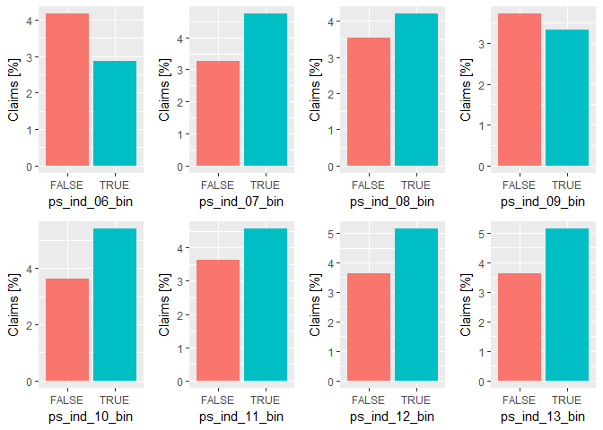
<p class="caption">
Fig. 10
</p>

``` r
p1 <- 1; p2 <- 1; p3 <- 1; p4 <- 1; p5 <- 1; p6 <- 1; p7 <- 1; p8 <- 1
```

Binary features part 2
----------------------

``` r
p1 <- train %>%
  group_by(ps_ind_16_bin, target) %>%
  count() %>%
  spread(target, n) %>%
  ggplot(aes(ps_ind_16_bin,`1`/(`1`+`0`)*100, fill = ps_ind_16_bin))+
  geom_bar(stat="identity")+
  theme(legend.position = "none") +
  labs(y = "Claims [%]")

p2 <- train %>%
  group_by(ps_ind_17_bin, target) %>%
  count() %>%
  spread(target, n) %>%
  ggplot(aes(ps_ind_17_bin,`1`/(`1`+`0`)*100, fill = ps_ind_17_bin))+
  geom_bar(stat="identity")+
  theme(legend.position = "none") +
  labs(y = "Claims [%]")

p3 <- train %>%
  group_by(ps_ind_18_bin, target) %>%
  count() %>%
  spread(target, n) %>%
  ggplot(aes(ps_ind_18_bin,`1`/(`1`+`0`)*100, fill = ps_ind_18_bin))+
  geom_bar(stat="identity")+
  theme(legend.position = "none") +
  labs(y = "Claims [%]")

p4 <- train %>%
  group_by(ps_calc_15_bin, target) %>%
  count() %>%
  spread(target, n) %>%
  ggplot(aes(ps_calc_15_bin,`1`/(`1`+`0`)*100, fill = ps_calc_15_bin))+
  geom_bar(stat="identity")+
  theme(legend.position = "none") +
  labs(y = "Claims [%]")

p5 <- train %>%
  group_by(ps_calc_16_bin, target) %>%
  count() %>%
  spread(target, n) %>%
  ggplot(aes(ps_calc_16_bin,`1`/(`1`+`0`)*100, fill = ps_calc_16_bin))+
  geom_bar(stat="identity")+
  theme(legend.position = "none") +
  labs(y = "Claims [%]")

p6 <- train %>%
  group_by(ps_calc_17_bin, target) %>%
  count() %>%
  spread(target, n) %>%
  ggplot(aes(ps_calc_17_bin,`1`/(`1`+`0`)*100, fill = ps_calc_17_bin))+
  geom_bar(stat="identity")+
  theme(legend.position = "none") +
  labs(y = "Claims [%]")

p7 <- train %>%
  group_by(ps_ind_18_bin, target) %>%
  count() %>%
  spread(target, n) %>%
  ggplot(aes(ps_ind_18_bin,`1`/(`1`+`0`)*100, fill = ps_ind_18_bin))+
  geom_bar(stat="identity")+
  theme(legend.position = "none") +
  labs(y = "Claims [%]")

p8 <- train %>%
  group_by(ps_calc_19_bin, target) %>%
  count() %>%
  spread(target, n) %>%
  ggplot(aes(ps_calc_19_bin,`1`/(`1`+`0`)*100, fill = ps_calc_19_bin))+
  geom_bar(stat="identity")+
  theme(legend.position = "none") +
  labs(y = "Claims [%]")

p9 <- train %>%
  group_by(ps_calc_20_bin, target) %>%
  count() %>%
  spread(target, n) %>%
  ggplot(aes(ps_calc_20_bin,`1`/(`1`+`0`)*100, fill = ps_calc_20_bin))+
  geom_bar(stat="identity")+
  theme(legend.position = "none") +
  labs(y = "Claims [%]")

layout <- matrix(c(1,2,3,4,5,6,7,8,9,9),2,5,byrow=TRUE)
multiplot(p1, p2, p3, p4, p5, p6, p7, p8, p9, layout=layout)
```

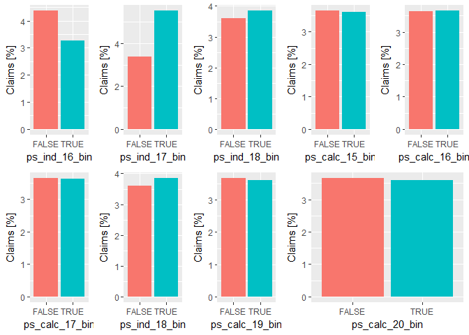
<p class="caption">
Fig. 11
</p>

``` r
p1 <- 1; p2 <- 1; p3 <- 1; p4 <- 1; p5 <- 1; p6 <- 1; p7 <- 1; p8 <- 1
```

Categorical features part 1
---------------------------

``` r
p1 <-  train %>%
  group_by(ps_ind_02_cat, target) %>%
  count() %>%
  spread(target, n) %>%
  ggplot(aes(ps_ind_02_cat,`1`/(`1`+`0`)*100, fill = ps_ind_02_cat))+
  geom_bar(stat="identity")+
  theme(legend.position = "none") +
  labs(y = "Claims [%]")

p2 <- train %>%
  group_by(ps_ind_04_cat, target) %>%
  count() %>%
  spread(target, n) %>%
  ggplot(aes(ps_ind_04_cat,`1`/(`1`+`0`)*100, fill = ps_ind_04_cat))+
  geom_bar(stat="identity")+
  theme(legend.position = "none") +
  labs(y = "Claims [%]")

p3 <- train %>%
  group_by(ps_ind_05_cat, target) %>%
  count() %>%
  spread(target, n) %>%
  ggplot(aes(ps_ind_05_cat,`1`/(`1`+`0`)*100, fill = ps_ind_05_cat))+
  geom_bar(stat="identity")+
  theme(legend.position = "none") +
  labs(y = "Claims [%]")

p4 <- train %>%
  group_by(ps_car_01_cat, target) %>%
  count() %>%
  spread(target, n) %>%
  ggplot(aes(ps_car_01_cat,`1`/(`1`+`0`)*100, fill = ps_car_01_cat))+
  geom_bar(stat="identity")+
  theme(legend.position = "none") +
  labs(y = "Claims [%]")

p5 <- train %>%
  group_by(ps_car_02_cat, target) %>%
  count() %>%
  spread(target, n) %>%
  ggplot(aes(ps_car_02_cat,`1`/(`1`+`0`)*100, fill = ps_car_02_cat))+
  geom_bar(stat="identity")+
  theme(legend.position = "none") +
  labs(y = "Claims [%]")

p6 <- train %>%
  group_by(ps_car_03_cat, target) %>%
  count() %>%
  spread(target, n) %>%
  ggplot(aes(ps_car_03_cat,`1`/(`1`+`0`)*100, fill = ps_car_03_cat))+
  geom_bar(stat="identity")+
  theme(legend.position = "none") +
  labs(y = "Claims [%]")

layout <- matrix(c(1,2,3,4,5,6),3,2,byrow=TRUE)
multiplot(p1, p2, p3, p4, p5, p6, layout=layout)
```

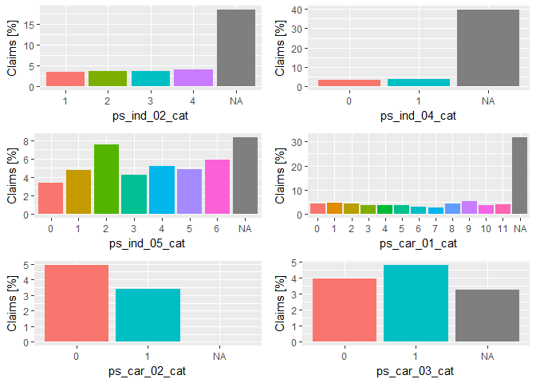
<p class="caption">
Fig. 12
</p>

``` r
p1 <- 1; p2 <- 1; p3 <- 1; p4 <- 1; p5 <- 1; p6 <- 1; p7 <- 1; p8 <- 1
```

Categorical features part 2
---------------------------

``` r
p1 <- train %>%
  group_by(ps_car_04_cat, target) %>%
  count() %>%
  spread(target, n) %>%
  ggplot(aes(ps_car_04_cat,`1`/(`1`+`0`)*100, fill = ps_car_04_cat))+
  geom_bar(stat="identity")+
  theme(legend.position = "none") +
  labs(y = "Claims [%]")

p2 <- train %>%
  group_by(ps_car_05_cat, target) %>%
  count() %>%
  spread(target, n) %>%
  ggplot(aes(ps_car_05_cat,`1`/(`1`+`0`)*100, fill = ps_car_05_cat))+
  geom_bar(stat="identity")+
  theme(legend.position = "none") +
  labs(y = "Claims [%]")

p3 <- train %>%
  group_by(ps_car_06_cat, target) %>%
  count() %>%
  spread(target, n) %>%
  ggplot(aes(ps_car_06_cat,`1`/(`1`+`0`)*100, fill = ps_car_06_cat))+
  geom_bar(stat="identity")+
  theme(legend.position = "none") +
  labs(y = "Claims [%]")

p4 <- train %>%
  group_by(ps_car_07_cat, target) %>%
  count() %>%
  spread(target, n) %>%
  ggplot(aes(ps_car_07_cat,`1`/(`1`+`0`)*100, fill = ps_car_07_cat))+
  geom_bar(stat="identity")+
  theme(legend.position = "none") +
  labs(y = "Claims [%]")

p5 <- train %>%
  group_by(ps_car_08_cat, target) %>%
  count() %>%
  spread(target, n) %>%
  ggplot(aes(ps_car_08_cat,`1`/(`1`+`0`)*100, fill = ps_car_08_cat))+
  geom_bar(stat="identity")+
  theme(legend.position = "none") +
  labs(y = "Claims [%]")

p6 <- train %>%
  group_by(ps_car_09_cat, target) %>%
  count() %>%
  spread(target, n) %>%
  ggplot(aes(ps_car_09_cat,`1`/(`1`+`0`)*100, fill = ps_car_09_cat))+
  geom_bar(stat="identity")+
  theme(legend.position = "none") +
  labs(y = "Claims [%]")

p7 <- train %>%
  group_by(ps_car_10_cat, target) %>%
  count() %>%
  spread(target, n) %>%
  ggplot(aes(ps_car_10_cat,`1`/(`1`+`0`)*100, fill = ps_car_10_cat))+
  geom_bar(stat="identity")+
  theme(legend.position = "none") +
  labs(y = "Claims [%]")

p8 <- train %>%
  group_by(ps_car_11_cat, target) %>%
  count() %>%
  spread(target, n) %>%
  ggplot(aes(ps_car_11_cat,`1`/(`1`+`0`)*100, fill = ps_car_11_cat))+
  geom_bar(stat="identity")+
  theme(legend.position = "none") +
  labs(y = "Claims [%]")

layout <- matrix(c(1,1,2,3,4,4,5,5,6,6,7,7,8,8,8,8),4,4,byrow=TRUE)
multiplot(p1, p2, p4, p3, p5, p6, p7, p8, layout=layout)
```

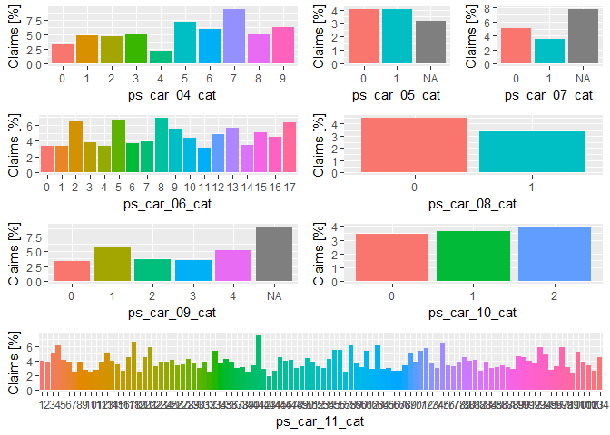
<p class="caption">
Fig. 12
</p>

``` r
p1 <- 1; p2 <- 1; p3 <- 1; p4 <- 1; p5 <- 1; p6 <- 1; p7 <- 1; p8 <- 1
```

Integer features part 1
-----------------------

``` r
p1 <- train %>%
  group_by(ps_ind_01, target) %>%
  count() %>%
  spread(target, n) %>%
  ggplot(aes(ps_ind_01,`1`/(`1`+`0`)*100, fill = ps_ind_01))+
  geom_bar(stat="identity")+
  theme(legend.position = "none") +
  labs(y = "Claims [%]")
  
p2 <- train %>%
  group_by(ps_ind_03, target) %>%
  count() %>%
  spread(target, n) %>%
  ggplot(aes(ps_ind_03,`1`/(`1`+`0`)*100, fill = ps_ind_03))+
  geom_bar(stat="identity")+
  theme(legend.position = "none") +
  labs(y = "Claims [%]")
  
p3 <- train %>%
  group_by(ps_ind_14, target) %>%
  count() %>%
  spread(target, n) %>%
  ggplot(aes(ps_ind_14,`1`/(`1`+`0`)*100, fill = ps_ind_14))+
  geom_bar(stat="identity")+
  theme(legend.position = "none") +
  labs(y = "Claims [%]")
  
p4 <- train %>%
  group_by(ps_ind_15, target) %>%
  count() %>%
  spread(target, n) %>%
  ggplot(aes(ps_ind_15,`1`/(`1`+`0`)*100, fill = ps_ind_15))+
  geom_bar(stat="identity")+
  theme(legend.position = "none") +
  labs(y = "Claims [%]")
  
p5 <- train %>%
  group_by(ps_car_11, target) %>%
  count() %>%
  spread(target, n) %>%
  ggplot(aes(ps_car_11,`1`/(`1`+`0`)*100, fill = ps_car_11))+
  geom_bar(stat="identity")+
  theme(legend.position = "none") +
  labs(y = "Claims [%]")

layout <- matrix(c(1,1,2,2,3,4,4,5),2,4,byrow=TRUE)
multiplot(p1, p2, p3, p4, p5, layout=layout)
```

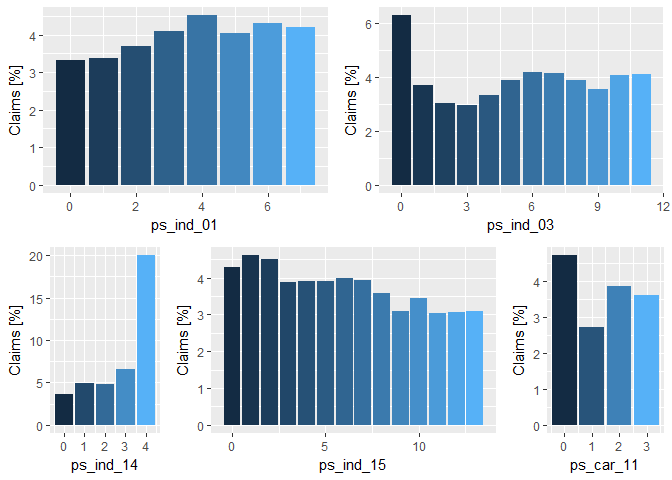
<p class="caption">
Fig. 13
</p>

Integer features part 2
-----------------------

``` r
p1 <- train %>%
  group_by(ps_calc_04, target) %>%
  count() %>%
  spread(target, n) %>%
  ggplot(aes(ps_calc_04,`1`/(`1`+`0`)*100, fill = ps_calc_04))+
  geom_bar(stat="identity")+
  theme(legend.position = "none") +
  labs(y = "Claims [%]")
  
p2 <- train %>%
  group_by(ps_calc_05, target) %>%
  count() %>%
  spread(target, n) %>%
  ggplot(aes(ps_calc_05,`1`/(`1`+`0`)*100, fill = ps_calc_05))+
  geom_bar(stat="identity")+
  theme(legend.position = "none") +
  labs(y = "Claims [%]")

p3 <- train %>%
  group_by(ps_calc_06, target) %>%
  count() %>%
  spread(target, n) %>%
  ggplot(aes(ps_calc_06,`1`/(`1`+`0`)*100, fill = ps_calc_06))+
  geom_bar(stat="identity")+
  theme(legend.position = "none") +
  labs(y = "Claims [%]")
  
p4 <- train %>%
  group_by(ps_calc_07, target) %>%
  count() %>%
  spread(target, n) %>%
  ggplot(aes(ps_calc_07,`1`/(`1`+`0`)*100, fill = ps_calc_07))+
  geom_bar(stat="identity")+
  theme(legend.position = "none") +
  labs(y = "Claims [%]")
  
p5 <- train %>%
  group_by(ps_calc_08, target) %>%
  count() %>%
  spread(target, n) %>%
  ggplot(aes(ps_calc_08,`1`/(`1`+`0`)*100, fill = ps_calc_08))+
  geom_bar(stat="identity")+
  theme(legend.position = "none") +
  labs(y = "Claims [%]")

p6 <- train %>%
  group_by(ps_calc_09, target) %>%
  count() %>%
  spread(target, n) %>%
  ggplot(aes(ps_calc_09,`1`/(`1`+`0`)*100, fill = ps_calc_09))+
  geom_bar(stat="identity")+
  theme(legend.position = "none") +
  labs(y = "Claims [%]")

p7 <- train %>%
  ggplot(aes(ps_calc_10, fill = target)) +
  geom_density(alpha = 0.5, bw = 0.4) +
  theme(legend.position = "none")

p8 <- train %>%
  ggplot(aes(ps_calc_11, fill = target)) +
  geom_density(alpha = 0.5, bw = 0.4) +
  theme(legend.position = "none")

p9 <- train %>%
  group_by(ps_calc_12, target) %>%
  count() %>%
  spread(target, n) %>%
  ggplot(aes(ps_calc_12,`1`/(`1`+`0`)*100, fill = ps_calc_12))+
  geom_bar(stat="identity")+
  theme(legend.position = "none") +
  labs(y = "Claims [%]")

p10 <- train %>%
  group_by(ps_calc_13, target) %>%
  count() %>%
  spread(target, n) %>%
  ggplot(aes(ps_calc_13,`1`/(`1`+`0`)*100, fill = ps_calc_13))+
  geom_bar(stat="identity")+
  theme(legend.position = "none") +
  labs(y = "Claims [%]")

p11 <- train %>%
  ggplot(aes(ps_calc_14, fill = target)) +
  geom_density(alpha = 0.5, bw = 0.4)

layout <- matrix(c(1,2,3,4,5,6,7,8,9,10,11,11),3,4,byrow=TRUE)
multiplot(p1, p2, p3, p4, p5, p6, p7, p8, p9, p10, p11, layout=layout)
```

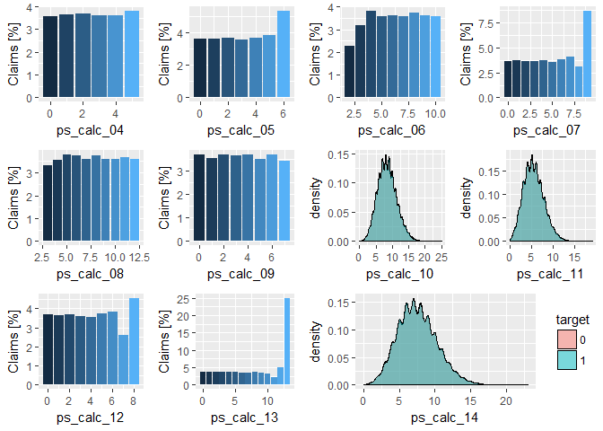
<p class="caption">
Fig. 14
</p>

``` r
p1 <- 1; p2 <- 1; p3 <- 1; p4 <- 1; p5 <- 1; p6 <- 1; p7 <- 1; p8 <- 1; p9 <- 1; p10 <- 1; p11 <- 1
```

Float features part 1
---------------------

``` r
p1 <- train %>%
  ggplot(aes(ps_reg_01, fill = target)) +
  geom_density(alpha = 0.5, bw = 0.05) +
  theme(legend.position = "none")

p2 <- train %>%
  ggplot(aes(ps_reg_02, fill = target)) +
  geom_density(alpha = 0.5, bw = 0.05) +
  theme(legend.position = "none")

p3 <- train %>%
  ggplot(aes(ps_reg_03, fill = target)) +
  geom_density(alpha = 0.5, bw = 0.05) +
  theme(legend.position = "none")

p4 <- train %>%
  ggplot(aes(ps_calc_01, fill = target)) +
  geom_density(alpha = 0.5, bw = 0.05) +
  theme(legend.position = "none")

p5 <- train %>%
  ggplot(aes(ps_calc_02, fill = target)) +
  geom_density(alpha = 0.5, bw = 0.05) +
  theme(legend.position = "none")

p6 <- train %>%
  ggplot(aes(ps_calc_03, fill = target)) +
  geom_density(alpha = 0.5, bw = 0.05)

layout <- matrix(c(1,2,3,4,5,6),2,3,byrow=TRUE)
multiplot(p1, p2, p3, p4, p5, p6, layout=layout)
```

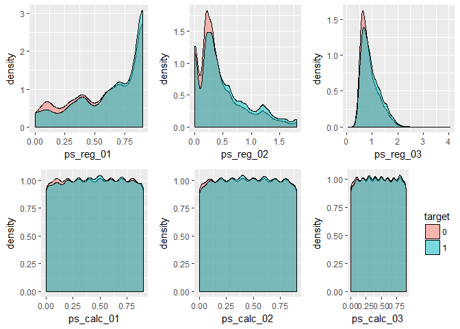
<p class="caption">
Fig. 15
</p>

Float features part 2
---------------------

``` r
p1 <- train %>%
  ggplot(aes(ps_car_12, fill = target)) +
  geom_density(alpha = 0.5, bw = 0.05) +
  theme(legend.position = "none")

p2 <- train %>%
  ggplot(aes(ps_car_13, fill = target)) +
  geom_density(alpha = 0.5, bw = 0.05) +
  theme(legend.position = "none")

p3 <- train %>%
  ggplot(aes(ps_car_14, fill = target)) +
  geom_density(alpha = 0.5, bw = 0.05) +
  theme(legend.position = "none")

p4 <- train %>%
  ggplot(aes(ps_car_15, fill = target)) +
  geom_density(alpha = 0.5, bw = 0.1) +
  theme(legend.position = "none")

layout <- matrix(c(1,2,3,4),2,2,byrow=TRUE)
multiplot(p1, p2, p3, p4, layout=layout)
```

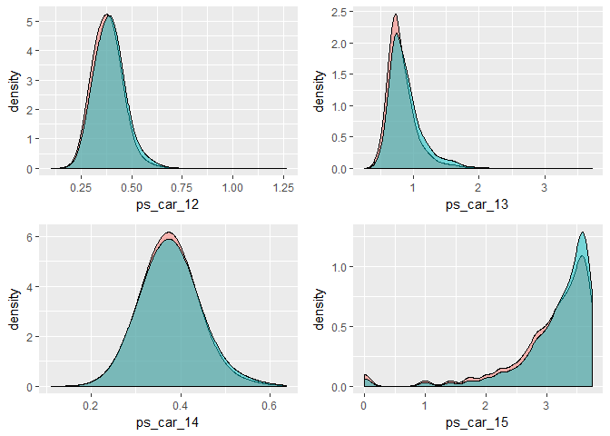
<p class="caption">
Fig. 16
</p>

XGB
===

Normalized Gini Coefficient
---------------------------

``` r
xgb_normalizedgini <- function(preds, dtrain){
  actual <- getinfo(dtrain, "label")
  score <- NormalizedGini(preds,actual)
  return(list(metric = "NormalizedGini", value = score))
}
```

feature engineering
-------------------

``` r
train <- fread(paste0("train.csv"), sep=",", na.strings = "", stringsAsFactors=T)
test <- fread(paste0("test.csv"), sep=",", na.strings = "", stringsAsFactors=T)
test$target <- NA
data <- rbind(train, test)
rm(train,test);gc()
```

    ##            used  (Mb) gc trigger   (Mb)  max used   (Mb)
    ## Ncells  2859616 152.8    5816772  310.7   5816772  310.7
    ## Vcells 87421615 667.0  168639396 1286.7 168178023 1283.1

``` r
data[-ps_calc_01]
```

    ## Empty data.table (0 rows) of 59 cols: id,target,ps_ind_01,ps_ind_02_cat,ps_ind_03,ps_ind_04_cat...

``` r
data[-ps_calc_02]
```

    ## Empty data.table (0 rows) of 59 cols: id,target,ps_ind_01,ps_ind_02_cat,ps_ind_03,ps_ind_04_cat...

``` r
data[-ps_calc_03]
```

    ## Empty data.table (0 rows) of 59 cols: id,target,ps_ind_01,ps_ind_02_cat,ps_ind_03,ps_ind_04_cat...

``` r
data[, ps_ind_14_ps_ind_12_bin := ps_ind_14*ps_ind_12_bin]
data[, ps_ind_17_bin_ps_ind_16_bin := ps_ind_17_bin*ps_ind_16_bin]
data[, ps_reg_03_ps_reg_02 := ps_reg_03*ps_reg_02]
data[, ps_car_15_ps_car_08_cat := ps_car_15*ps_car_08_cat]
data[, ps_car_14_ps_car_12 := ps_car_14*ps_car_12 ]
data[, ps_car_13_ps_reg_03 := ps_car_13*ps_reg_03]
data[, ps_reg_mult := ps_reg_01*ps_reg_02*ps_reg_03]
data[, ps_ind_bin_sum := ps_ind_06_bin+ps_ind_07_bin+ps_ind_08_bin+ps_ind_09_bin+ps_ind_10_bin+ps_ind_11_bin+ps_ind_12_bin+ps_ind_13_bin+ps_ind_16_bin+ps_ind_17_bin+ps_ind_18_bin]
```

XGBoost advance preparation
---------------------------

``` r
cvFolds <- createFolds(data$target[!is.na(data$target)], k=5, list=TRUE, returnTrain=FALSE)
varnames <- setdiff(colnames(data), c("id", "target"))
train_sparse <- Matrix(as.matrix(data[!is.na(target), varnames, with=F]), sparse=TRUE)
test_sparse <- Matrix(as.matrix(data[is.na(target), varnames, with=F]), sparse=TRUE)
y_train <- data[!is.na(target),target]
test_ids <- data[is.na(target),id]
dtrain <- xgb.DMatrix(data=train_sparse, label=y_train)
dtest <- xgb.DMatrix(data=test_sparse)
```

XGBoost parameters and fitting

``` r
param <- list(booster="gbtree",
              objective="binary:logistic", 
              eta = 0.02,
              gamma = 1,
              max_depth = 6, 
              min_child_weight = 1,
              subsample = 0.8,
              colsample_bytree = 0.8,
              seed = 123
)
xgb_cv <- xgb.cv(data = dtrain,
                  params = param,
                 nrounds = 5000,
                  feval = xgb_normalizedgini,
                 maximize = TRUE,
                prediction = TRUE,
               folds = cvFolds,
              print_every_n = 25,
             early_stopping_round = 30,
           set.seed(123)
           )
```

    ## [1]  train-NormalizedGini:0.216418+0.004850  test-NormalizedGini:0.208031+0.005044 
    ## Multiple eval metrics are present. Will use test_NormalizedGini for early stopping.
    ## Will train until test_NormalizedGini hasn't improved in 30 rounds.
    ## 
    ## [26] train-NormalizedGini:0.266379+0.001136  test-NormalizedGini:0.244840+0.001418 
    ## [51] train-NormalizedGini:0.277604+0.001373  test-NormalizedGini:0.249850+0.001307 
    ## [76] train-NormalizedGini:0.285635+0.002014  test-NormalizedGini:0.253264+0.001177 
    ## [101]    train-NormalizedGini:0.292483+0.001330  test-NormalizedGini:0.255187+0.001549 
    ## [126]    train-NormalizedGini:0.300590+0.001619  test-NormalizedGini:0.258129+0.002213 
    ## [151]    train-NormalizedGini:0.311049+0.000731  test-NormalizedGini:0.261959+0.001759 
    ## [176]    train-NormalizedGini:0.322801+0.000706  test-NormalizedGini:0.265639+0.002058 
    ## [201]    train-NormalizedGini:0.334611+0.000711  test-NormalizedGini:0.269232+0.002287 
    ## [226]    train-NormalizedGini:0.345440+0.000293  test-NormalizedGini:0.271969+0.002764 
    ## [251]    train-NormalizedGini:0.355771+0.000636  test-NormalizedGini:0.274177+0.003137 
    ## [276]    train-NormalizedGini:0.365602+0.000562  test-NormalizedGini:0.275991+0.003432 
    ## [301]    train-NormalizedGini:0.375227+0.000430  test-NormalizedGini:0.277667+0.003536 
    ## [326]    train-NormalizedGini:0.384907+0.000439  test-NormalizedGini:0.279021+0.003605 
    ## [351]    train-NormalizedGini:0.394096+0.001059  test-NormalizedGini:0.280051+0.003425 
    ## [376]    train-NormalizedGini:0.402785+0.001285  test-NormalizedGini:0.280535+0.003657 
    ## [401]    train-NormalizedGini:0.410763+0.001141  test-NormalizedGini:0.280864+0.003973 
    ## [426]    train-NormalizedGini:0.418783+0.001219  test-NormalizedGini:0.281253+0.003987 
    ## [451]    train-NormalizedGini:0.426819+0.001165  test-NormalizedGini:0.281358+0.003984 
    ## [476]    train-NormalizedGini:0.434174+0.001722  test-NormalizedGini:0.281567+0.004158 
    ## [501]    train-NormalizedGini:0.441029+0.001519  test-NormalizedGini:0.281680+0.004231 
    ## [526]    train-NormalizedGini:0.447383+0.001785  test-NormalizedGini:0.281919+0.004315 
    ## [551]    train-NormalizedGini:0.453933+0.001400  test-NormalizedGini:0.282157+0.004400 
    ## [576]    train-NormalizedGini:0.460224+0.001099  test-NormalizedGini:0.282460+0.004384 
    ## [601]    train-NormalizedGini:0.466191+0.001183  test-NormalizedGini:0.282461+0.004503 
    ## Stopping. Best iteration:
    ## [590]    train-NormalizedGini:0.463571+0.001123  test-NormalizedGini:0.282609+0.004305

``` r
best_iter <- xgb_cv$best_iteration

xgb_model <- xgb.train(data = dtrain,
                       params = param,
                       nrounds = best_iter,
                       feval = xgb_normalizedgini,
                       maximize = TRUE,
                       watchlist = list(train = dtrain),
                       verbose = 1,
                       print_every_n = 25,
                       set.seed(123)

)
```

    ## [1]  train-NormalizedGini:0.220439 
    ## [26] train-NormalizedGini:0.262224 
    ## [51] train-NormalizedGini:0.273585 
    ## [76] train-NormalizedGini:0.277857 
    ## [101]    train-NormalizedGini:0.284851 
    ## [126]    train-NormalizedGini:0.292263 
    ## [151]    train-NormalizedGini:0.302241 
    ## [176]    train-NormalizedGini:0.312502 
    ## [201]    train-NormalizedGini:0.322575 
    ## [226]    train-NormalizedGini:0.333002 
    ## [251]    train-NormalizedGini:0.341620 
    ## [276]    train-NormalizedGini:0.349946 
    ## [301]    train-NormalizedGini:0.357990 
    ## [326]    train-NormalizedGini:0.366520 
    ## [351]    train-NormalizedGini:0.373940 
    ## [376]    train-NormalizedGini:0.382180 
    ## [401]    train-NormalizedGini:0.389911 
    ## [426]    train-NormalizedGini:0.397084 
    ## [451]    train-NormalizedGini:0.403969 
    ## [476]    train-NormalizedGini:0.409386 
    ## [501]    train-NormalizedGini:0.415878 
    ## [526]    train-NormalizedGini:0.422772 
    ## [551]    train-NormalizedGini:0.428088 
    ## [576]    train-NormalizedGini:0.433976 
    ## [590]    train-NormalizedGini:0.436868

``` r
names <- dimnames(train_sparse)[[2]]
importance_matrix <- xgb.importance(names, model=xgb_model)
xgb.plot.importance(importance_matrix)
```

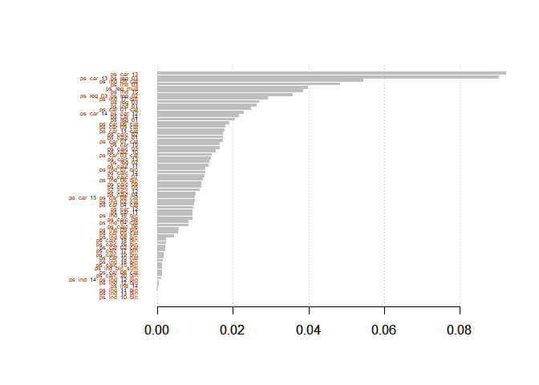

``` r
preds <- data.table(id=test_ids, target=predict(xgb_model,dtest))
write.table(preds, "submission.csv", sep=",", dec=".", quote=FALSE, row.names=FALSE)
```
